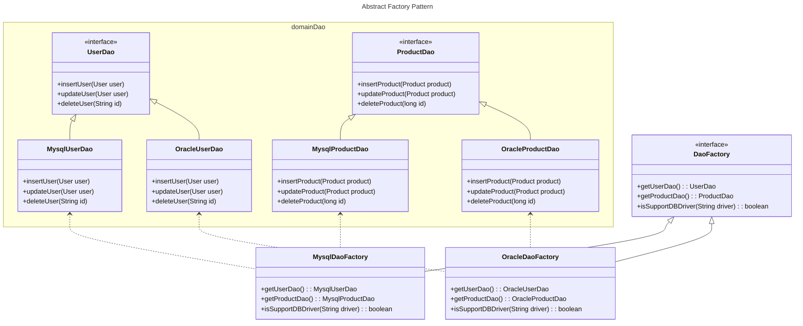

```mermaid
---
title: Abstract Factory Pattern
---
classDiagram

    DaoFactory <|-- MysqlDaoFactory
    DaoFactory <|-- OracleDaoFactory

    MysqlUserDao <.. MysqlDaoFactory
    MysqlProductDao <.. MysqlDaoFactory
    UserDao <|-- MysqlUserDao
    ProductDao <|-- MysqlProductDao

    OracleUserDao <.. OracleDaoFactory
    OracleProductDao <.. OracleDaoFactory
    UserDao <|-- OracleUserDao
    ProductDao <|-- OracleProductDao

    

    class DaoFactory {
       <<interface>>
       +getUserDao() : UserDao
       +getProductDao() : ProductDao
       +isSupportDBDriver(String driver) : boolean
    }
    class MysqlDaoFactory{
       +getUserDao() : MysqlUserDao
       +getProductDao() : MysqlProductDao
       +isSupportDBDriver(String driver) : boolean
    }


    class OracleDaoFactory{
       +getUserDao() : OracleUserDao
       +getProductDao() : OracleProductDao
       +isSupportDBDriver(String driver) : boolean
    }

namespace domainDao {
    class UserDao {
       <<interface>>
       +insertUser(User user)
       +updateUser(User user)
       +deleteUser(String id)
    }
    class MysqlUserDao{
       +insertUser(User user)
       +updateUser(User user)
       +deleteUser(String id)
    }
    class OracleUserDao{
       +insertUser(User user)
       +updateUser(User user)
       +deleteUser(String id)
    }

    class ProductDao {
       <<interface>>
       +insertProduct(Product product)
       +updateProduct(Product product)
       +deleteProduct(long id)
    }
    class MysqlProductDao{
       +insertProduct(Product product)
       +updateProduct(Product product)
       +deleteProduct(long id)
    }
    class OracleProductDao{
       +insertProduct(Product product)
       +updateProduct(Product product)
       +deleteProduct(long id)
    }
}
```