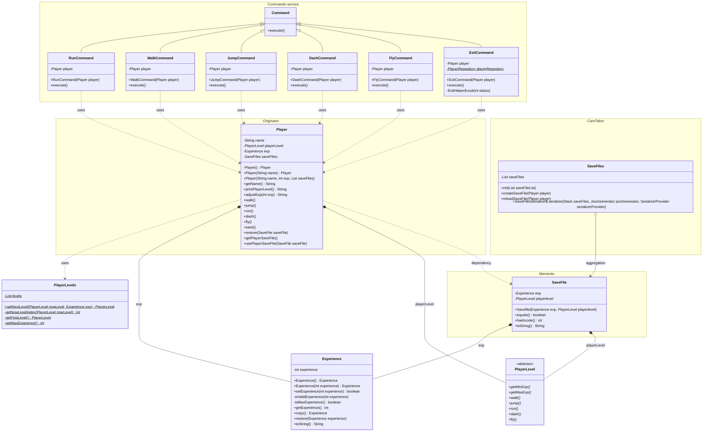

## 프로젝트 설명
기존에 구현된 memento pattern에 command Pattern을 적용했다.
#### 입력 값
- 0 : 프로그램 종료 
- 1 : player walk동작 실행
- 2 : player jump동작 실행
- 3 : player run동작 실행
- 4 : player dash동작 실행
- 5 : player fly동작 실행
 
 
 

### class 설명 
#### o Save file
현재 레벨과 경험치를 저장하는 객체이다.

#### o SaveFiles
- careTaker 역할을 하는 일급컬렉션이다.
- 동작성 검증을 위해 SaveFilesTest에서 Juit5를 이용하여 검증하였다.

#### o PlayerController
- 사용자에게 입력받은 command를 기반으로 player의 동작을 실행한다.
- 만약 존재하지 않는 command를 입력 받는다면 "잘못된 입력입니다."를 노출한다.

### o PlayerRepository
- exit command가 실행될 때 Player의 정보를 json형태로 저장한다.
- 프로그램이 시작될 때 json 형태로 저장된 Player의 정보가 있다면 로드한다.

### class diagram
