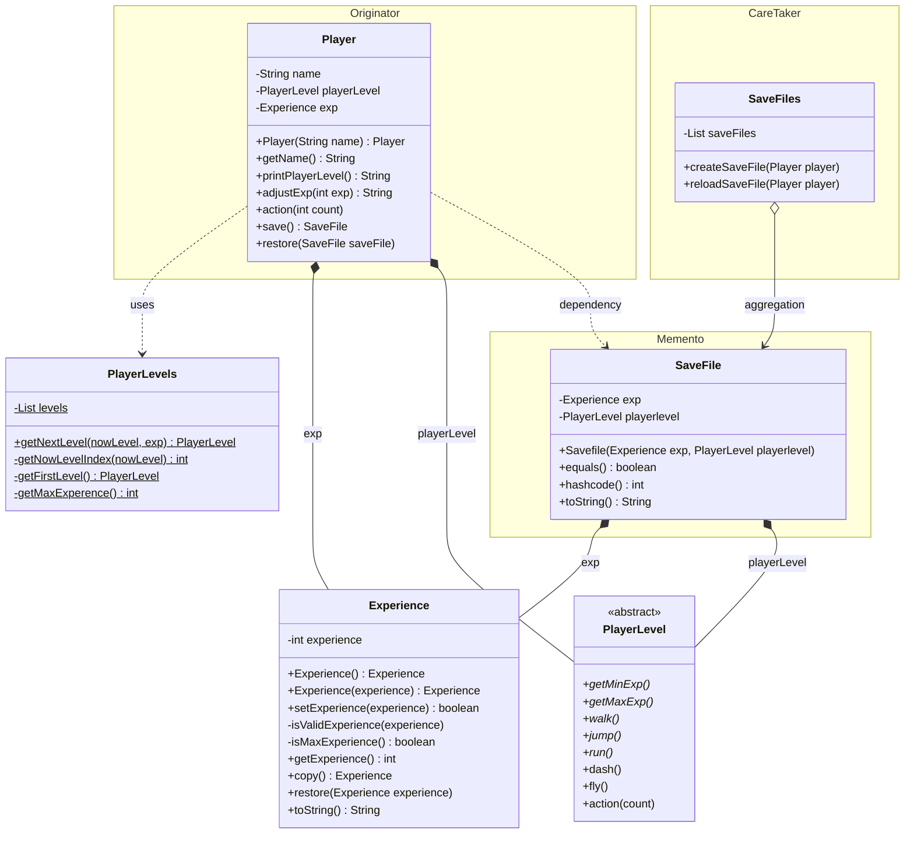

## 프로젝트 설명
기존에 구현된 strategy pattern 프로젝트에 memento pattern을 적용했다.

### class 설명 
#### o Save file
현재 레벨과 경험치를 저장하는 객체이다.

#### o SaveFiles
- careTaker 역할을 하는 일급컬렉션이다.
- 동작성 검증을 위해 SaveFilesTest에서 Juit5를 이용하여 검증하였다.

### class diagram
