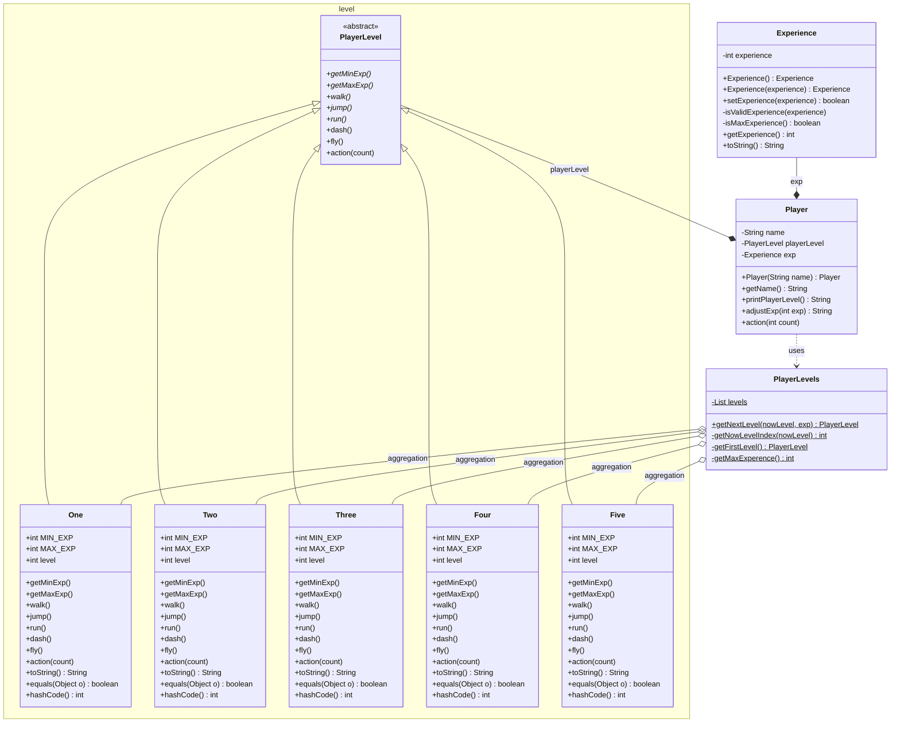

## 프로젝트 설명
경험치를 획득하면 레벨업을 하는 로직을 strategy pattern을 이용하여 구현했다.

### 레벨 설명
레벨업을 관리하기 위해서 멤버변수로 Level 리스트를 갖는 일급 컬렉션(PlayerLevels)을 생성했다.
- Level 1 : 캐릭터 생성시 default 레벨
- Level 2 : 누적 경험치 1000을 얻었을 때 2레벨로 레벨업한다.
- Level 3 : 누적 경험치 2000을 얻었을 때 3레벨로 레벨업한다.
- Level 4 : 누적 경험치 3000을 얻었을 때 4레벨로 레벨업한다.
- Level 5 : 누적 경험치 5000을 얻었을 때 5레벨로 레벨업한다. 최고 레벨이다.

### 예외 처리
- 마이너스 경험치는 입력될 수 없으며 입력시 IllegalArgumentException이 발생한다.
- 전달된 현재 레벨이 레벨 일급 컬렉션에 존재하지 않으면 IllegalArgumentException이 발생한다.
관련한 예외 처리는 PlayerTest에서 Junit5를 이용하여 검증했다.

